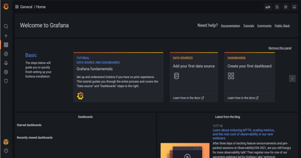

# Step 1: Install and set up Grafana

### Grafana
Grafana provides a dashboards for viewing metrics. By monitoring the data from our WordPress. For instance it can show the recent query execute and the general log, error log, which can monitor if any invalid user using the WordPress or Database.

We can set up Grafana by using either individual container or YAML file as common practice. Create the file `docker-compose.yml` as follows. The configuration file will startup you WordPress, MySQL and Grafana containers. The three containers can communicate through the docker network. Also, the port `80` in the WordPress application is mapped to the host port `20080`. 

```sh
version: '3.2'
services:
    mysql-server:
        container_name: mysql
        ports:
            - "13306:3306"
        environment:
            MYSQL_ROOT_PASSWORD: 12345
            MYSQL_DATABASE: wordpress
            MYSQL_USER: wordpress_user
            MYSQL_PASSWORD: secret
        image: mysql/mysql-server
        command: 
            --general-log=ON
            --log-output=TABLE
        volumes:
            - ./init:/docker-entrypoint-initdb.d
    wordpress:
        image: wordpress:latest
        container_name: wordpress
        ports:
            - "20080:80"
        environment:
            WORDPRESS_DB_HOST: mysql-server:3306
            WORDPRESS_DB_USER: wordpress_user
            WORDPRESS_DB_PASSWORD: secret
        depends_on:
            - mysql-server 
    grafana:
        container_name: grafana
        image: grafana/grafana
        ports:
            - "3000:3000"
        environment:
            ADMIN_USER: "ADMIN"
            ADMIN_PASSWORD: "ADMIN"
```

After the file have been saved, execute the follow command to start up the container.

> `docker-compose up`{{execute}}

### Set up Grafana
**1. Login to Grafana**
After start up the container, visit http://localhost:3000/login to login the grafana account.
As in the YAML we have set `'ADMIN'` as username and password. Then it will request you to assign new username and password. Then you can arrived the home page.


**2. Add data source**
As we need to connect our MySQL and WordPress with Grafana, we need to do the MySQL Connection in Settings.

Press `Add data source` to connect the database. 


Select `MySQL` to connect the database, it provided many data source like `Oracle`. 


Fill in the information as follow and press `Save & test`. All the information should be according to the YAML file, if no sql document is embedded. For instance, in `docker-compose.yml` the `MYSQL_DATABASE` have set as `wordpress`, the `MYSQL_USER` is `wordpress_user` and the `MYSQL_PASSWORD` is `secret`. 


After set up the MySQL connection, back to home page to edit the dashboard.


